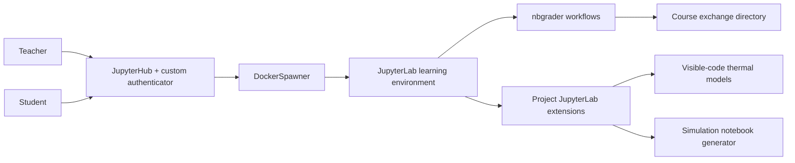

# Open-source Jupyter-based Engineering Education and Simulation Platform

[](LICENSE)

一个面向工程教育与仿真的开源 Jupyter 平台参考实现，集成了 JupyterHub、JupyterLab、nbgrader、DockerSpawner 与可见源码的热力学仿真工作流。项目旨在帮助教师部署课程环境、发布与评阅 Notebook 作业，并让学生从交互式界面进入可复现、可阅读的科学计算过程。

> **项目状态：** 参考实现，持续维护中。仓库优先服务于教学部署、课程实验与 JupyterLab 扩展开发；它不是 JupyterLab 或 nbgrader 的替代发行版。

English: an open-source JupyterHub reference implementation for engineering education, combining course management, nbgrader workflows, and visible-code thermal simulation extensions for JupyterLab.

## What this project provides

- **Multi-user teaching environment** — JupyterHub, DockerSpawner, custom registration/authentication, role-based access, and Chinese-language portal templates.
- **Coursework and grading workflows** — nbgrader integration, shared exchange directories, teacher/student separation, and course-aware permissions.
- **Visible-code thermal modelling** — JupyterLab extensions that generate editable notebooks for heat-transfer calculations and examples rather than hiding the numerical method behind a black box.
- **Reusable simulation tooling** — template-based simulation notebook generation and Markdown-region parameter binding for interactive, reproducible exercises.
- **Containerized delivery** — a Docker image definition that pins the core notebook environment and installs the project extensions.

## Architecture



## Project-owned components

The project-specific integration and extension work is concentrated in the following areas:

| Area | Purpose |
| --- | --- |
| `custom_authenticator.py`, `jupyterhub_config.py`, `templates/` | Registration, access control, course groups, and the JupyterHub portal. |
| `jupyterlab-thermal-design/` | Thermal-design calculations and editable notebook generation. |
| `jupyterlab-simulation-platform/` | Template-driven simulation notebook generation. |
| `jupyterlab-param-binding/` | Generic Markdown-region parameter binding for notebooks. |
| `jupyterlab-official-thermal-examples/` | Thermal modelling examples designed for classroom use. |
| `Dockerfile-nbgrader`, `docker_*_config.py` | Reproducible notebook image and runtime configuration. |

## Upstream components and attribution

This repository includes checked-in source trees for **JupyterLab** (`jupyterlab/`) and **nbgrader** (`nbgrader/`) so that the integration can be built, tested, and studied in a reproducible local context. They remain independent upstream projects, are **not claimed as original work of this project**, and retain their own licenses and copyright notices.

See [NOTICE](NOTICE) for the attribution and licensing boundary. For the project-specific code and documentation, see [LICENSE](LICENSE).

## Quick start

### Prerequisites

- Docker Engine
- A JupyterHub host configured with DockerSpawner
- Sufficient CPU, memory, and disk space to build JupyterLab and the included extensions

### Build the single-user notebook image

From the repository root:

```bash
docker build -f Dockerfile-nbgrader -t wsl-jupyter-nbgrader .
```

The Dockerfile builds the notebook image only. A production deployment also needs a JupyterHub host, a DockerSpawner configuration, persistent course storage, and an environment-specific review of the paths and network addresses in `jupyterhub_config.py`. Do not use the included development defaults as a production security baseline.

## Documentation

- [Project detail summary (Chinese)](项目总结/项目详细总结v2.md)
- [Research and design report (Chinese)](项目总结/项目研究报告v2.md)
- [Architecture and implementation notes (Chinese)](项目总结/项目架构与框架实现说明.md)
- [Changelog](CHANGELOG.md)
- [Contributing guide](CONTRIBUTING.md)
- [Security policy](SECURITY.md)

## Contributing and support

Bug reports, deployment feedback, teaching use cases, and documentation improvements are welcome. Please read [CONTRIBUTING.md](CONTRIBUTING.md) before opening an issue. For security-sensitive reports, follow [SECURITY.md](SECURITY.md) and do not disclose credentials, student data, or deployment details publicly.

## License

Project-specific code and documentation are available under the [BSD 3-Clause License](LICENSE). Third-party and upstream components keep the terms provided in their own directories; see [NOTICE](NOTICE).
