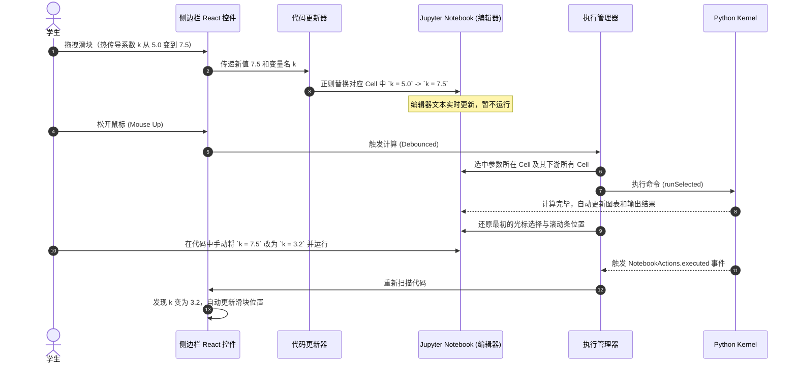

# 自动双向绑定与交互参数滑块系统设计规格说明书 (Spec)

## 1. 概述与设计背景
目前仿真插件（如热设计插件中的参数面板）是单向且静态生成的：用户点击执行后，生成一个包含特定代码的 Notebook。如果学生在 Notebook 中修改了变量，前端侧边栏滑块无法感知；反之，也无法在侧边栏调节参数并直接让 Notebook 运行计算并更新图表。

本设计提出 **混合双向绑定模式 (方案 C)**：
- **无侵入性语法**：在 Notebook 单元格代码中，通过在变量后添加 `# @param` 注释，标记该变量需要进行前端滑块绑定。
- **自动提取**：侧边栏自动监听并解析活动 Notebook 中的所有 `# @param` 标记，生成 React 控件。
- **双向联动**：
  1. 拖动侧边栏滑块 -> 实时更新单元格代码文本 -> 释放鼠标时运行该单元格及其下游的所有单元格 -> Kernel 计算刷新图表。
  2. 手动在 Notebook 中改代码并执行 -> 侧边栏滑块同步更新。

---

## 2. 语法标记规范 (Syntax Specification)
插件将解析代码单元格中符合以下格式的行：
```python
变量名 = 默认值  # @param {type:"控件类型", ...属性键值对}
```
正则表达式定义：
```javascript
const paramRegex = /^([a-zA-Z_][a-zA-Z0-9_]*)\s*=\s*(.+?)\s*#\s*@param\s*(\{.*\})\s*$/;
```

### 支持控件与属性配置：
1. **数值滑块 (Slider)**
   - 语法：`k = 5.0  # @param {type:"slider", min:0.1, max:20.0, step:0.1, label:"热传导系数 (W/m·K)"}`
   - 属性：`min` (最小值)、`max` (最大值)、`step` (步长)、`label` (前端显示名)
2. **下拉选择框 (Dropdown)**
   - 语法：`bc = "steady"  # @param {type:"dropdown", options:["steady", "transient"], label:"边界条件"}`
   - 属性：`options` (备选数组)、`label`
3. **数值输入框 (Number Input)**
   - 语法：`steps = 100  # @param {type:"number", min:10, max:1000, label:"迭代计算步数"}`
   - 属性：`min`、`max`、`label`
4. **布尔开关 (Checkbox)**
   - 语法：`grid = True  # @param {type:"boolean", label:"网格背景"}`
   - 属性：`label`

---

## 3. 详细架构设计 (Architectural Design)

### 3.1 核心前端模块
1. **`NotebookTracker`**
   - 依赖 JupyterLab 的 `INotebookTracker`。
   - 监听 `currentChanged`，当用户切换 Notebook 时，重新扫描当前 Notebook；监听当前 Notebook 单元格的新增、删除和执行。
2. **`CellCodeParser`**
   - 遍历 Notebook 的所有代码单元格，将每行文本通过 `paramRegex` 进行匹配。
   - 若匹配成功，提取参数配置并利用 JSON-like 解析器解析 metadata。
   - 生成一个参数对象树，其中记录每个参数属于哪个 `Cell`、当前数值、变量名和配置信息。
3. **`SidebarPanel` (React Widget)**
   - 渲染参数控件列表。
   - 监听当前活动的 Markdown 标题（从参数单元格往上查找最近的 Heading 单元格，如 `# 物理参数`），将其作为分组项折叠显示。
   - 顶部提供“手动刷新”和“自动计算开关（默认开启）”。
4. **`CellCodeUpdater`**
   - 侧边栏拖动滑块时，精确将该参数所在单元格的代码行替换为 `变量名 = 新值  # @param ...`，更新 `cell.model.sharedModel.setSource(newSource)`。
5. **`CellExecutionManager`**
   - 拖拽松开（`onChangeEnd`）或点击输入时，定位参数所在单元格。
   - 自动选中该单元格及之后的所有单元格。
   - 执行 `NotebookActions.runSelected(notebook, panel.sessionContext)`。
   - 执行后恢复之前的活动单元格状态与页面滚动条位置，实现无感自动计算。

### 3.2 运行时时序图



---

## 4. 容错与优化设计

### 4.1 死循环预防
在 `CellCodeUpdater` 修改代码时，会临时将 `isSyncingFromSidebar` 标记设为 `true`。在此期间，`NotebookActions.executed` 触发的代码重新扫描和数值反向同步将被跳过，防止双方循环更新。

### 4.2 计算防抖与开关
对于滑块，由于用户松开鼠标前可能快速多次调整，只在 React 组件的 `onChangeEnd` 事件响应时触发计算。如果学生打算一次性修改多个滑块而不希望频繁启动下游大计算量计算，可关闭侧边栏顶部的“自动运行”开关，修改完毕后手动点击“运行下游”按钮。

### 4.3 界面状态自适应
若当前 Notebook 的 Kernel 处于未连接、繁忙（Busy）或计算死机状态，侧边栏滑块显示为置灰加载状态，并在顶部显示黄色提示条，确保学生能够清晰感知系统健康状况。

---

## 5. 验证计划 (Verification Plan)

### 5.1 手动与自动测试用例
1. **解析测试**：
   - 创建包含各种 `# @param` 注释的单元格。测试侧边栏是否能成功加载所有 4 种类型的控件，并且对于没有写注释的普通代码行不会误判。
2. **正向联动测试**：
   - 拖动侧边栏滑块，验证 Notebook 内对应行代码的数值是否以 `k = 7.5` 的形式实时变更。
   - 松开滑块，验证参数所在单元格和其下方的图表单元格是否自动运行，并且 Matplotlib 图表是否基于新参数重绘。
3. **反向同步测试**：
   - 在 Notebook 代码框中手动输入 `k = 3.2` 并按 Shift+Enter 运行，验证侧边栏滑块是否瞬间从原有位置跳转到 `3.2`。
4. **光标保护测试**：
   - 在拖拽滑块运行计算时，将光标定位在后方的任意一个 markdown 或代码单元格上，验证计算完成后，光标和视图是否没有发生抖动或丢失。
