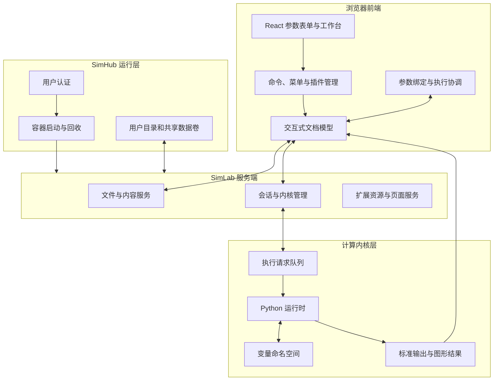
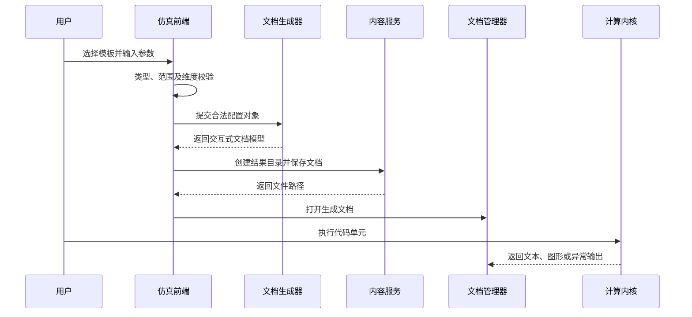

# 面向代码可见性的原理仿真培训系统设计与实现——以热力建模为例

> 项目研究报告 v0.2  
> 文档性质：硕士学位论文式项目研究报告  
> 研究对象：SimLab 原理仿真培训系统

## 摘要

工程原理培训既要求学习者理解数学模型、离散方法和求解流程，又要求其能够改变参数、观察响应并追溯结果产生的原因。传统仿真软件通常将模型封装在固定界面中，虽然操作门槛较低，但计算过程不透明；直接编写计算程序又要求学习者同时掌握编程环境、依赖配置和可视化方法，容易使培训重点从工程原理偏移到工具使用。针对上述矛盾，本项目设计并实现了一套面向代码可见性的原理仿真培训系统 SimLab。

系统以开源交互式计算框架为基础进行二次开发，将图形化配置、计算代码生成、内核执行、结果可视化和参数交互组织为统一工作流。系统采用浏览器前端、服务端资源管理和独立计算内核相分离的架构。前端扩展负责模型选择、参数配置、输入校验和交互式计算文档生成；服务端负责文件、会话和用户空间管理；计算内核负责实际数值运算，并将执行状态及结果回传到文档模型。围绕原理仿真需求，项目实现了参数自动绑定方法，通过识别文档中的参数区域、解析普通变量赋值、合并参数元数据，将代码变量映射为滑块、数值框、下拉框等控件，并在修改后安全回写源代码、触发相关计算单元及其下游单元重新执行。

在功能实现方面，系统包括通用原理仿真平台和传热原理仿真平台。通用平台提供代数公式、一阶动态系统、二阶动态系统、线性方程组、一维传递过程、时序能量平衡和优化调度七类模板；传热平台覆盖稳态导热、瞬态导热、对流换热和热辐射四类共十四个模型，并综合使用解析法、有限差分法、有限体积法和经验关联式。为验证系统对复杂工程过程的表达能力，项目进一步构建了槽式太阳能集热—双罐熔盐储热—汽轮机发电的24小时动态建模示例，实现日照输入、热量收集、储热状态更新、运行模式切换、发电输出和综合指标分析。

研究表明，本系统能够在不隐藏计算过程的前提下降低原理仿真的配置成本，使图形化交互与可阅读、可修改、可执行的计算代码保持一致。项目形成了“模板生成—参数绑定—内核计算—结果解释”的闭环，可作为能源、传热及相关工程课程的原理培训和建模实践基础。

**关键词：** 原理仿真；代码可见性；参数自动绑定；交互式计算；数值传热；热力建模

## Abstract

Engineering simulation training requires learners to understand mathematical models, numerical procedures, and the causal relationship between parameters and results. Conventional simulation software often hides the computational process behind fixed graphical interfaces, whereas direct programming imposes additional burdens involving environment configuration, dependencies, and visualization. To balance operability and transparency, this project develops SimLab, a visible-code training system for principle-oriented simulation.

The system is built through secondary development on top of open-source interactive computing components. It separates the browser-based frontend, server-side resource management, and independent computing kernels. The frontend extensions provide model selection, parameter configuration, validation, and executable document generation. The server manages files, sessions, and isolated user workspaces, while kernels perform numerical computation and return outputs to the document model. A metadata-assisted parameter binding method identifies parameter regions, parses ordinary variable assignments, maps variables to interactive controls, rewrites source code safely, and reruns the affected cell and its downstream cells.

SimLab contains a general-purpose simulation platform with seven template families and a heat-transfer platform with fourteen models covering steady conduction, transient conduction, convection, and radiation. A 24-hour parabolic-trough solar collection, molten-salt storage, and power-generation example is provided to demonstrate multi-stage thermal process modeling. The resulting workflow connects template generation, parameter binding, kernel execution, and result interpretation while preserving readable and modifiable source code.

**Keywords:** principle-oriented simulation; visible code; parameter binding; interactive computing; numerical heat transfer; thermal modeling

---

## 术语与研究边界

为保持全文命名一致，本文采用以下术语：

| 术语 | 本文含义 |
| --- | --- |
| SimLab | 面向用户的交互式计算与原理仿真工作台 |
| SimHub | 提供多用户接入、会话调度和计算环境启动的服务层 |
| SimGrader | 位于系统后端的作业发布、提交、验证和评测辅助模块 |
| 交互式计算文档 | 由说明单元、代码单元、输出和元数据共同组成的可执行文档 |
| 参数层代码 | 集中声明模型输入变量、可被参数绑定模块识别的代码区域 |
| 代码可见性 | 模型假设、参数、求解步骤和结果处理以可阅读代码形式向学习者开放 |

本项目始于开源交互式计算、多人服务和作业评测组件的集成开发。本文不将上游通用能力表述为项目原创成果；自主开发和重点改造内容主要包括统一的 SimLab 产品界面、通用仿真模板体系、传热仿真模型与计算文档生成器、参数自动绑定机制、热力过程综合示例，以及面向培训场景的系统集成和中文化改造。

---

# 第1章 绪论

## 1.1 研究背景

随着能源动力、机械、建筑环境和过程工程等专业逐渐强化计算能力培养，仿真已经从科研辅助工具转变为工程教育的重要组成部分。学习者不仅需要得到一个数值结果，还应理解结果所依赖的控制方程、边界条件、参数量纲、离散格式与计算流程。对于稳态导热、储能动态、能量平衡和热力系统调度等问题，若培训系统只呈现输入框和结果图，学习者很难判断计算模型采用了何种简化，也难以把课堂公式与程序实现建立联系。

另一方面，直接要求初学者从空白文件编写完整程序会引入较高的非专业负担。环境安装、程序结构、绘图库使用和文件管理均可能成为学习障碍。一个适用于原理培训的系统应在“完全黑箱”和“完全自由编程”之间建立中间层：使用图形界面帮助学习者快速建立合法模型，同时生成结构清晰的计算代码，使其可以继续阅读、修改和运行。

本项目围绕这一中间层展开。SimLab 将模型模板、参数表单、交互式计算文档、参数控件和计算内核连接起来，既保留图形化系统的易用性，也保留程序化建模的透明性与可扩展性。

## 1.2 问题提出

面向原理仿真的培训系统需要解决以下问题：

1. **模型表达与操作便利性的矛盾。** 图形界面适合快速配置，但容易隐藏公式和算法；纯代码具有透明性，但操作成本较高。
2. **参数交互与源代码一致性问题。** 若参数控件与代码维护两套状态，容易出现界面显示值与实际执行值不一致。
3. **多类模型的统一组织问题。** 代数模型、动态系统、矩阵方程、传热离散模型和调度模型在输入结构与求解过程上存在明显差异，需要统一抽象而不能过度简化。
4. **专业模型的可验证性问题。** 数值结果必须能通过解析解、守恒关系、稳定性条件或经验关联式进行核查。
5. **复杂热力过程的教学表达问题。** 单点公式不足以展示集热、储热、发电与运行策略之间的时序耦合，需要显式保留状态推进和模式切换逻辑。

## 1.3 研究目标

本项目的总体目标是实现一套代码可见、参数可交互、过程可追溯的原理仿真培训系统。具体目标包括：

- 建立前端、服务端和计算内核分离的系统架构；
- 建立面向多类工程问题的仿真模板抽象；
- 生成包含问题描述、建模假设、参数、求解和可视化的交互式计算文档；
- 实现由普通代码变量到图形控件的自动绑定；
- 构建覆盖导热、对流和辐射的专业传热模型库；
- 通过集热—储热—发电综合案例验证复杂热力过程表达能力；
- 保留多用户运行和作业评测等支撑能力，但不使其偏离原理仿真的研究主线。

## 1.4 研究内容

本文研究内容分为五个层次。

第一，研究系统总体架构。分析浏览器前端、扩展插件、文档模型、服务端、计算内核和容器运行环境之间的边界及通信流程。

第二，研究参数自动绑定方法。以参数层代码和文档元数据为桥梁，从普通变量赋值中提取参数，生成交互控件，并保持控件状态、源代码和执行结果的一致性。

第三，研究通用原理仿真平台。通过七类模板覆盖公式计算、常微分动力学、线性系统、空间离散、时序能量平衡和优化调度问题。

第四，研究传热原理仿真平台。将热物理输入、控制方程、数值离散、指标输出与图形结果组织成可执行文档，形成十四个专业模型。

第五，研究热力系统综合建模。以槽式太阳能热发电为对象，构建24小时规则驱动动态过程，分析集热、储热、发电与弃热之间的能量关系。

## 1.5 技术路线

项目技术路线可概括为：需求分析→架构设计→模板抽象→计算文档生成→参数绑定→内核执行→模型验证→系统集成。


## 1.6 主要工作与特点

与仅封装求解器的仿真界面相比，本项目具有以下特点：

1. 提出代码可见式工作流，生成结果的同时生成可阅读、可修改的完整计算过程。
2. 使用参数区域语义和元数据实现松耦合绑定，不要求模型代码依赖专用控件函数。
3. 建立通用模板与专业传热平台并行的双平台结构，共享文档规范和参数绑定能力。
4. 将模型验证信息直接纳入输出，例如数值解与解析解误差、稳定性参数和适用条件判断。
5. 通过24小时热力过程案例展示连续能量流、离散状态更新和运行策略切换。

## 1.7 论文结构

第2章介绍原理仿真、代码可见式计算和参数化建模基础；第3章从计算机系统角度详细分析总体架构；第4章讨论参数自动绑定；第5章讨论通用原理仿真平台；第6章讨论传热原理仿真平台；第7章给出热力建模综合示例；第8章介绍多用户运行和辅助评测；第9章进行测试与综合评价；第10章总结全文并提出展望。

---

# 第2章 原理仿真系统的理论与技术基础

## 2.1 原理仿真培训的基本要求

原理仿真不同于仅以预测精度或生产效率为目标的工程软件。其输出不仅包括数值，还包括学习者理解模型所需的中间信息。本文将原理仿真的基本对象表示为

\[
\mathcal{S}=\{P,A,M,N,R,V\},
\]

其中，\(P\) 为问题描述，\(A\) 为建模假设，\(M\) 为数学模型，\(N\) 为数值方法，\(R\) 为计算结果，\(V\) 为验证信息。若系统只保留 \(P\) 和 \(R\)，则学习者无法追踪模型形成过程；代码可见式系统的目标是让上述六类信息都能在同一计算文档中被查阅和修改。

## 2.2 交互式计算文档

交互式计算文档由有序单元构成。说明单元承载标题、公式、假设和分析提示；代码单元承载参数、模型、求解和绘图程序；输出对象保存文本、表格、图形或错误信息；文档元数据描述运行环境和参数绑定配置。

从数据结构角度，可将文档表示为

\[
D=(C_1,C_2,\ldots,C_n,\mathcal{M}),
\]

其中 \(C_i\) 为第 \(i\) 个单元，\(\mathcal{M}\) 为文档级元数据。单元的顺序同时表达阅读顺序和默认执行依赖。参数变化后从参数单元向后执行，能够维持“参数→模型→求解→结果”的因果顺序。

## 2.3 代码可见式仿真

代码可见式仿真并不是简单地把内部源代码暴露给用户，而是对代码进行教学化组织。系统生成的文档遵循以下原则：

- 参数集中声明，变量名、单位和物理意义清晰；
- 求解过程分步骤展开，避免将全部逻辑隐藏在单个不可见接口中；
- 关键控制方程和离散公式由说明单元给出；
- 可视化代码与结果同时保留，便于修改图形表达；
- 对重要适用条件进行显式检查；
- 结果分析提示与程序输出相邻。

因此，图形界面负责降低第一次建模的门槛，生成后的计算文档则承担深入学习和二次探索任务。

## 2.4 模板驱动生成

模板驱动生成把模型中稳定的结构与用户可变参数分离。模板定义包含模板标识、输入配置类型、默认值、校验规则和生成函数。用户配置记为 \(x\)，模板生成器记为 \(G_k\)，则第 \(k\) 类仿真文档为

\[
D_k=G_k(x), \qquad x\in\Omega_k,
\]

其中 \(\Omega_k\) 是由数据类型、取值范围、维度关系和物理约束共同确定的合法配置域。前端先验证 \(x\in\Omega_k\)，再生成文档，从而避免大量明显错误进入计算内核。

模板方法适合原理培训的原因在于：它既能够统一文档结构，又允许不同模型保留各自的公式和求解过程。系统只抽象共同骨架，不强迫所有模型使用相同算法。

## 2.5 参数化建模与元数据

参数控件需要知道变量类型、显示名称、上下限、步长、选项和分组信息。仅依赖源代码可以识别数值和字符串，却无法可靠推断完整的教学语义；仅依赖独立配置又可能与源代码失去同步。为此，本项目采用“代码为当前值真源、元数据补充交互语义”的方法。

设源代码解析结果为 \(S(v)\)，参数元数据为 \(M(v)\)，则最终控件配置为

\[
B(v)=S(v)\oplus M(v),
\]

其中 \(\oplus\) 表示以显式元数据覆盖自动推断值的合并操作。该方法允许普通变量赋值在没有额外配置时形成基础控件，同时允许专业模型对范围、标签和选项进行精确控制。

## 2.6 数值方法与模型验证

系统模型主要使用以下方法：

- 代数公式直接计算和参数扫描；
- 显式时间推进求解一阶、二阶动态系统；
- 线性代数方法求解节点平衡方程；
- 有限差分法处理一维和二维导热；
- 有限体积法处理复合介质和隐式瞬态导热；
- 经验关联式计算对流换热；
- 辐射网络与等效热阻计算表面辐射；
- 规则驱动状态推进处理时序能量系统。

模型验证采用分层策略：有解析解时比较最大误差；有守恒关系时计算能量平衡；存在稳定性条件时输出无量纲参数；经验模型则检查雷诺数等适用范围；复杂过程通过储热上下界、功率限制和运行模式一致性进行验证。

## 2.7 本章小结

本章给出了原理仿真系统的理论对象，说明交互式计算文档、模板驱动生成、元数据参数化和数值验证之间的关系。上述理论构成系统架构和核心模块设计的基础。

---

# 第3章 系统需求分析与总体架构设计

## 3.1 系统需求分析

### 3.1.1 功能需求

系统应支持模型选择、参数配置、输入校验、文档预览、计算文档生成、文件保存、内核运行、参数交互、结果可视化和结果归档。专业传热模型还应给出方程、边界条件、数值方法、工程指标和验证信息。对于多用户环境，系统需要为不同用户创建独立计算会话和工作目录。

### 3.1.2 非功能需求

1. **透明性：** 参数、核心算法和结果处理代码应可见。
2. **一致性：** 图形控件值、代码值和执行结果应保持同步。
3. **扩展性：** 新增模板或专业模型不应修改核心工作台逻辑。
4. **可靠性：** 非法参数应在前端或模型入口被识别，单个模型错误不应破坏其他文档。
5. **可复现性：** 文档应保存完整参数与代码，重新打开后能够在相同环境中执行。
6. **隔离性：** 多用户计算进程、文件和运行资源应相互隔离。

## 3.2 总体分层架构

SimLab 采用前后端分离并结合独立计算内核的多层架构。系统不是传统的“浏览器—业务服务器—数据库”三层应用，而是在服务端之外增加了面向科学计算的有状态内核层。



从职责上看，浏览器前端不直接承担大规模数值计算，服务端不解释具体模型算法，计算内核也不负责界面布局。三者通过文档模型、内容接口和会话接口连接，使界面、存储和计算可以独立演进。

## 3.3 前端架构

### 3.3.1 插件化扩展机制

系统各功能以插件形式注册到 SimLab。插件在启动时声明自身标识、依赖服务和激活函数，并通过命令注册表提供“打开通用仿真平台”“打开传热仿真平台”等动作。主菜单、命令面板和布局恢复模块只引用命令标识，不直接依赖具体工作台实现。

该机制带来三点优势：第一，通用仿真、传热仿真、参数绑定和热力示例可以独立构建；第二，功能入口与业务组件解耦；第三，工作台关闭和重新打开时可以由布局跟踪器恢复状态。

### 3.3.2 表现层与状态管理

工作台界面使用组件化前端技术实现。模板选择器负责切换模型类型，参数表单负责编辑配置，预览组件负责展示将要生成的文档结构，状态区域负责反馈校验或生成结果。配置对象是表单层的单一状态源；每次输入变化产生新的配置对象，并触发派生校验结果重新计算。

系统没有把数值求解嵌入界面组件。前端只完成以下工作：

\[
\text{用户输入}\rightarrow\text{配置对象}\rightarrow\text{合法性校验}\rightarrow\text{文档模型生成}。
\]

真正的模型代码随后由计算内核运行。这种分离避免了浏览器数值环境与计算文档环境产生两套结果。

### 3.3.3 文档模型

文档模型是前端和计算内核之间的核心数据载体。每个文档由单元列表、运行环境信息和参数绑定元数据组成。代码单元包含源代码、执行计数和输出列表；说明单元包含公式及解释；文档级元数据记录内核语言和可绑定参数。

生成器先在内存中构造标准文档对象，再调用内容服务保存为文件。由于文档本身包含参数值和算法代码，它既是运行载体，也是实验记录。结果文件名经过非法字符过滤并增加时间标识，统一存入仿真结果目录，以降低文件覆盖风险。

## 3.4 服务端架构

### 3.4.1 内容服务

内容服务为浏览器前端提供目录查询、新建目录、文件保存、重命名和打开等接口。生成流程首先检查结果目录是否存在；若不存在，则创建临时目录并重命名；随后将文档模型以结构化数据保存，最后通过文档管理命令打开文件。

前端不直接操作服务端文件系统路径，而是使用内容服务提供的抽象接口。这使本地单用户环境和 SimHub 容器环境可以共享相同扩展代码。

### 3.4.2 会话服务

会话服务维护文档与计算内核的关联关系，负责启动、连接、重启和关闭内核。前端文档面板持有会话上下文，参数绑定模块通过该上下文提交执行请求。会话层屏蔽了内核进程的地址、生命周期和消息传输细节。

### 3.4.3 静态资源与扩展服务

前端扩展经过编译后形成浏览器可加载资源，由服务端在启动时发现并提供。不同仿真模块各自维护源代码和样式，但在运行时共享 SimLab 的命令系统、文档管理、内容服务和会话服务。这一模式使专业模型能够作为业务扩展加入，而无需复制完整工作台。

## 3.5 计算内核处理机制

### 3.5.1 内核职责

计算内核是系统执行数值算法的独立进程，其主要职责包括：

- 接收代码单元执行请求；
- 在当前会话的变量命名空间中解释执行代码；
- 管理导入库、变量和函数等有状态对象；
- 返回标准输出、异常、表格和图形数据；
- 将执行结果关联到对应代码单元。

内核与浏览器分离后，前端页面刷新不会直接改变已启动内核中的变量状态；文档重新连接会话后仍可继续交互。但这种有状态特性也要求系统遵守执行顺序，否则可能出现代码文本已更新而内存变量尚未更新的问题。

### 3.5.2 单元执行与依赖顺序

系统使用文档单元顺序表示主要数据依赖。参数单元执行后，模型、求解和绘图单元依次读取其变量。参数自动绑定模块定位参数所在单元后，构造从该单元到文档末尾的单元集合，并通过会话上下文顺序提交执行。其基本过程为：

```text
定位参数单元 → 更新单元源码 → 选取当前及下游单元
             → 提交执行请求 → 内核更新状态 → 输出回写文档
```

与只重新执行参数单元相比，下游执行可以避免结果仍引用旧变量；与每次执行全文相比，从参数单元开始可以跳过环境说明和无关初始化内容。

### 3.5.3 异常传播

输入错误首先由前端校验器拦截；模型适用范围错误由生成代码或求解器检查；运行时错误由内核形成异常输出并返回文档。参数绑定模块捕获执行请求层面的异常，避免未处理异常破坏侧边栏状态。分层错误处理使错误尽可能接近其产生位置。

## 3.6 前后端通信与数据流

### 3.6.1 首次生成流程



该流程中传输的数据主要有三类：配置对象、文档结构和内核消息。配置对象只在浏览器内使用；文档结构通过内容接口持久化；代码和输出通过会话通道在文档前端与内核间交换。

### 3.6.2 参数修改流程

已生成文档中的参数修改不再经过原始模板表单，而是由绑定侧边栏直接操作文档：

\[
\text{控件值}\rightarrow\text{类型规范化}\rightarrow\text{赋值语句回写}
\rightarrow\text{下游执行}\rightarrow\text{输出刷新}。
\]

因此，模板表单负责创建初始实验，参数绑定负责对实验进行连续探索，二者分别对应“建模”和“试验”阶段。

## 3.7 模块划分与接口

| 模块 | 输入 | 输出 | 主要职责 |
| --- | --- | --- | --- |
| 模板注册模块 | 模板标识 | 默认配置、校验器、生成器 | 管理通用模型类型 |
| 仿真工作台 | 用户输入 | 合法配置对象 | 表单交互、预览与状态提示 |
| 文档生成模块 | 配置对象 | 交互式文档模型 | 生成说明、参数、求解和绘图单元 |
| 参数绑定模块 | 文档单元与元数据 | 控件模型、更新后的源码 | 扫描变量、映射控件和触发执行 |
| 内容服务 | 文档模型与路径 | 持久化文件 | 目录和文件管理 |
| 会话服务 | 文档及内核请求 | 会话状态 | 管理内核生命周期和连接 |
| 计算内核 | 代码与当前命名空间 | 输出或异常 | 执行数值计算 |
| 专业求解模块 | 模型参数 | 指标与图形数据 | 实现传热模型和验证计算 |

模块接口尽量使用结构化配置和标准文档对象，避免组件通过页面元素或全局变量隐式通信。

## 3.8 SimHub 容器化部署架构

在多用户模式下，SimHub 负责认证、用户会话和计算容器调度。每个用户启动独立容器，容器内运行 SimLab 服务端和计算内核。用户主目录通过数据卷持久化，共享交换目录用于培训资料或作业流转。容器停止后计算进程可被回收，而用户文件保留在宿主机数据卷中。

教师或课程管理相关目录可依据用户所属组在容器启动前动态挂载。开发环境还允许通过开关挂载本地扩展源代码，但生产环境应使用构建进镜像的固定版本，以确保运行结果可复现。

## 3.9 架构设计评价

该架构的主要优点是职责清晰：前端适合快速交互，服务端负责资源管理，内核专注计算，SimHub 负责多用户运行。其限制在于系统同时包含浏览器状态、文档状态和内核状态，若执行顺序或会话连接不正确，可能产生状态不一致。项目通过单一配置对象、源代码真源、下游顺序执行和结果文档持久化降低这一风险。

## 3.10 本章小结

本章从计算机系统角度分析了 SimLab 的总体架构。系统采用前端扩展、服务端资源管理、独立计算内核和容器化多用户运行四层结构，通过文档模型连接界面、存储与计算。该架构为参数自动绑定和双仿真平台提供了统一基础。

---

# 第4章 参数自动绑定方法设计与实现

## 4.1 设计目标

参数自动绑定是连接图形化操作与代码可见性的关键机制。传统做法通常在代码中直接调用控件库，此时模型代码与特定界面框架耦合；另一种做法是在界面保存独立参数副本，又容易与计算代码不一致。本项目的设计目标是：模型仍使用普通变量赋值，绑定模块通过文档结构和元数据识别变量，并把界面修改直接写回代码。

参数绑定应满足以下约束：

- 不改变普通代码的独立可执行性；
- 支持数值、布尔值和字符串等基础类型；
- 支持滑块、数值框、下拉框、布尔框和文本框；
- 保留赋值语句前的缩进和行尾注释；
- 不使用不受控的表达式求值解析参数；
- 参数变化后能够重新执行依赖结果；
- 已配置参数和自动发现参数能够同时出现。

## 4.2 参数区域语义

系统使用说明标题“参数层代码”作为区域起点。扫描器依次遍历文档单元，当遇到匹配标题时进入参数区域；后续代码单元中的普通赋值语句成为候选参数；当遇到同级或更高层级的下一个说明标题时结束扫描。

这种基于文档结构的区域约定具有两点意义。第一，它避免扫描模型层产生的大量临时变量；第二，参数区域同时是面向学习者的语义分区，与生成文档的阅读结构一致。

设文档单元序列为 \(C_1,\ldots,C_n\)，参数标题位于 \(C_s\)，终止标题位于 \(C_e\)，则扫描范围为

\[
\mathcal{R}=\{C_i\mid s<i<e,\; type(C_i)=code\}。
\]

## 4.3 变量赋值解析

扫描器逐行识别形如“变量名=字面量”的赋值语句。变量名必须符合标识符规则；当前值只接受有限类型的字面量，包括整数、浮点数、科学计数法、布尔值、单引号字符串和双引号字符串。复杂函数调用、列表推导式和任意表达式不会被当作可绑定值。

这一限制有意缩小了解析范围。若使用通用求值函数处理源代码，恶意或错误表达式可能在扫描阶段被执行；有限字面量解析则只进行字符串匹配和类型转换，不触发计算。

每个解析结果包含：变量名、当前值、值类型、原始字面量、所在单元标识、单元索引、行号和区域标题。这些定位信息用于后续精确回写。

## 4.4 元数据模型与合并策略

文档级参数元数据采用“版本—区域标题—参数映射”的结构。单个参数配置可包含：

| 字段 | 作用 |
| --- | --- |
| type | 控件类型 |
| label | 面向用户的参数名称 |
| min、max | 数值范围 |
| step | 控件步长 |
| options | 下拉选项集合 |
| group | 侧边栏分组名称 |

扫描得到的代码值始终作为当前值，元数据用于补充交互属性。若变量没有显式元数据，系统根据值类型生成默认控件；若存在显式配置，则保留代码当前值并覆盖标签、范围、步长和选项。

这种合并策略避免了元数据保存旧值的问题。重新打开文档时，侧边栏重新扫描源代码，因此代码是参数当前状态的唯一真源。

## 4.5 控件自动推断

数值参数默认形成数值控件，也可配置为滑块。未指定范围时，系统依据当前值推断上下限：非负参数通常以下界0开始，负值参数保留覆盖当前值的负区间；上界根据当前值绝对量级扩展。步长依据数值量级推断，并保证为正数。

为防止配置值非法，系统会对控件属性进行规范化：若最大值不大于最小值，则自动扩大区间；若步长大于整个区间，则缩小到可用尺度；控件显示值被限制在合法范围内。字符串、布尔值和下拉选项使用相应类型控件，不参与数值范围计算。

需要强调的是，自动推断只提供可用默认值。厚度、发射率、温度等专业参数应由模型生成器写入明确的元数据范围，以体现物理边界，而不是完全依赖数值量级猜测。

## 4.6 源代码安全回写

当用户修改控件时，系统首先根据原始值类型格式化新值。数值写为有限数字，布尔值写为标准布尔字面量，字符串进行引号和转义处理。随后利用变量名和记录的行号定位原赋值语句，仅替换等号后的字面量部分，同时保留前导空白和行尾注释。

设原始行由前缀 \(p\)、值 \(v\) 和注释后缀 \(q\) 组成：

\[
L=p+v+q。
\]

新值 \(v'\) 写回后得到

\[
L'=p+v'+q。
\]

若记录行已发生改变，系统重新检查变量名，避免误改相邻代码。更新完成后直接设置代码单元的共享文档源码，使编辑器、文档模型和保存内容同步变化。

## 4.7 下游自动执行

代码回写只改变静态文档，不会自动改变内核命名空间。为保证执行状态一致，绑定模块在写回后定位参数单元，以单元稳定标识为首选、原始索引为后备，选取该单元及其后的所有单元，通过当前会话上下文顺序执行。

参数更新算法可概括为：

```text
输入：新控件值、参数定位信息、当前文档和内核会话
1. 按原始类型规范化新值
2. 定位参数代码单元和赋值行
3. 替换赋值字面量并更新共享源码
4. 由稳定单元标识重新确定起始位置
5. 选取起始单元至文档末尾的代码执行序列
6. 向当前计算内核提交顺序执行请求
7. 根据文档输出刷新侧边栏显示状态
```

稳定单元标识可以抵抗用户在参数单元之前插入或删除单元造成的索引漂移。仅在无法找到标识时才使用保存的索引。

## 4.8 配置编辑与动态刷新

参数侧边栏不仅显示控件，还允许编辑控件类型、标签、最小值、最大值、步长、选项和分组。这些配置保存到文档元数据中。保存配置后，侧边栏重新扫描文档并构造控件，以保证元数据修改立即生效。

侧边栏监听活动文档变化和代码单元执行事件。用户切换文档、手动修改参数代码或执行单元后，绑定列表会重新解析，从而减少界面缓存与代码状态之间的偏差。

## 4.9 双平台复用

通用仿真平台和传热仿真平台生成的文档都遵守参数层约定，并写入相同版本的绑定元数据。参数绑定模块不需要知道模型属于哪一平台，只依赖文档结构和元数据接口。因此，新增专业模型时只需在生成器中提供参数代码与绑定配置，无需修改侧边栏核心逻辑。

这一设计使参数绑定成为跨模型基础能力，而不是某个求解器的专用附件。

## 4.10 边界与局限

当前方法主要面向集中参数和顺序执行文档。若参数由数组、字典嵌套结构或函数返回值产生，有限字面量解析不会自动绑定；若文档存在跨单元的复杂非线性依赖，简单的“从当前单元向后执行”可能执行冗余代码。未来可在保持安全性的前提下扩展结构化参数语法，并引入显式依赖图。

## 4.11 本章小结

本章提出并实现了面向普通源代码的参数自动绑定方法。该方法以参数区域为语义边界，以代码值为状态真源，以元数据补充交互语义，通过安全回写和下游执行保持控件、代码、内核与结果一致。

---

# 第5章 通用原理仿真平台设计与实现

## 5.1 平台定位

通用原理仿真平台用于快速构建跨专业基础模型。它不以覆盖某一学科全部求解功能为目标，而是提炼常见计算结构，使学习者从一个合法、可运行的示例开始，再修改公式、参数和算法。

平台工作流为：选择模板→填写问题描述与假设→输入参数或序列→实时校验→预览文档结构→生成并打开计算文档→运行与修改→参数交互和结果归档。

## 5.2 模板抽象

每个模板配置都包含模板标识、仿真名称、问题描述、假设、参数定义和输出说明，并根据模型类型扩展专用字段。模板注册表负责返回默认配置和校验器；生成器根据模板标识分派到对应实现。

生成器返回统一的文档部件：标题、问题描述、假设、参数表、数学模型、参数代码、模型代码、求解代码、可视化代码、结果分析代码、修改建议和分析提示。文档工厂再按统一顺序组合这些部件，并写入参数绑定元数据。

## 5.3 输入校验

输入校验分为四类：

1. 基础校验，如名称和问题描述非空、数值有限；
2. 范围校验，如时间步长、扫描点数和物理容量为正；
3. 结构校验，如矩阵维度与右端向量长度一致；
4. 关联校验，如时序发电、负荷和电价序列等长，SOC上下限关系合法。

校验结果由多个验证器合并。存在错误时，生成按钮被禁用并显示具体消息，避免无效配置生成不完整文档。

## 5.4 统一文档结构

通用仿真文档按照“问题—假设—参数—模型—求解—可视化—结果—修改建议”组织。参数代码集中在一个区域，后续模型层尽量将计算过程分解为具有语义的变量和循环。统一结构降低了不同模板之间的学习迁移成本。

## 5.5 代数公式与参数扫描

代数模板处理

\[
y=f(p_1,p_2,\ldots,p_m)。
\]

用户输入参数和公式表达式，系统在受限符号规则下检查表达式，并生成单点计算代码。若启用参数扫描，则选定参数 \(p_j\) 在区间 \([a,b]\) 内取 \(n\) 个值，逐点计算输出并绘制曲线或柱状图。该模板适合效率、功率、阻力和简单能量关系的敏感性分析。

## 5.6 一阶动态系统

一阶动态模板处理

\[
\frac{dx}{dt}=f(t,x,p),
\]

并采用显式欧拉格式

\[
x_{k+1}=x_k+\Delta t f(t_k,x_k,p)。
\]

生成文档显式保留时间数组、初始值、导数函数和时间循环，便于学习者观察离散公式如何转化为程序。默认示例可表达储能SOC变化，也可通过修改导数函数用于温度集总模型或一阶控制对象。

## 5.7 二阶动态系统

二阶模板以质量—阻尼—刚度系统为代表：

\[
m\ddot{x}+c\dot{x}+kx=F(t)。
\]

令 \(v=\dot{x}\)，得到

\[
\dot{x}=v,\qquad \dot{v}=\frac{F(t)-cv-kx}{m}。
\]

系统分别更新速度和位移，并输出位移、速度曲线及峰值。通过修改 \(m,c,k\) 和外部激励，学习者可以比较欠阻尼、临界阻尼和过阻尼响应。

## 5.8 线性系统

线性模板处理节点平衡方程

\[
A\boldsymbol{x}=\boldsymbol{b}。
\]

用户输入未知量名称、系数矩阵、右端向量和方程说明。平台检查矩阵为方阵且维度一致，再生成矩阵求解与残差输出代码。该模板可用于稳态热网络、电路网络和多节点能量平衡。

## 5.9 一维传递过程

一维传递模板以扩散方程为基础：

\[
\frac{\partial T}{\partial t}=\alpha\frac{\partial^2T}{\partial x^2}。
\]

稳态问题形成三对角线性系统；瞬态问题采用显式差分，并计算网格傅里叶数

\[
Fo=\frac{\alpha\Delta t}{\Delta x^2}。
\]

当 \(Fo>0.5\) 时文档给出稳定性警告。结果展示空间分布或多个时间快照，使离散网格、边界条件和稳定性之间的关系可见。

## 5.10 时序能量平衡

时序能量平衡模板按“发电优先供负荷—余量充电—不足放电—剩余购电”的规则逐时推进。储能状态更新为

\[
SOC_{t+1}=SOC_t+\frac{\eta_c P_{c,t}\Delta t}{E}
-\frac{P_{d,t}\Delta t}{\eta_d E}。
\]

充放电功率同时受功率上限和SOC边界约束。文档输出购电量、弃电量、自消纳率和SOC曲线，适合分析储能容量和运行规则。

## 5.11 优化调度

优化调度模板将充电功率、放电功率、购电功率、弃电功率和各时刻SOC作为决策变量，以逐时购电成本最小为目标：

\[
\min \sum_t c_tP_{grid,t}\Delta t。
\]

约束包括功率平衡、SOC状态方程、充放电功率界限和SOC上下限。系统将其组装为线性规划并调用数值优化器求解，输出总成本、购电量、弃电量和调度曲线。该模板使学习者能够从规则控制过渡到约束优化。

## 5.12 文件生成与结果归档

生成文档的文件名由模板标识、仿真名称和时间信息构成，并过滤路径保留字符。所有通用仿真结果进入统一结果目录。保存后文档自动打开但不强制立即执行，学习者可以先检查代码再运行。

## 5.13 本章小结

本章构建了由七类模板组成的通用原理仿真平台。平台通过统一配置、分层校验和文档生成骨架覆盖从代数关系到优化调度的典型计算结构，为专业传热平台提供了可复用的交互范式。

---

# 第6章 传热原理仿真平台设计与实现

## 6.1 总体设计

传热原理仿真平台是面向专业知识的第二个仿真平台。与通用平台相比，它预置更完整的物理假设、参数范围、控制方程、适用条件和工程指标。平台包含前端参数工作台、计算文档生成器和传热求解模块三部分。

前端工作台提供模型选择和参数配置；文档生成器把模型说明与可见代码组织成标准计算文档；求解模块按模型标识路由到具体算法，并统一返回指标集合和图形数据。当前实现共注册十四个模型。

## 6.2 统一模型接口

每个传热模型接收参数字典并返回

\[
R=\{I,C\},
\]

其中 \(I\) 为指标映射，\(C\) 为图形数据。指标包含热流、热阻、换热系数、无量纲数、误差或方法说明；图形数据包含横纵坐标、轴标签和标题。统一返回结构使不同物理模型可以共享结果展示流程。

## 6.3 稳态导热模型

### 6.3.1 单层平板

无内热源、常物性一维平板满足

\[
\frac{d^2T}{dx^2}=0,
\]

边界为 \(T(0)=T_h\)、\(T(L)=T_c\)。模型采用中心差分构造线性方程组，并与线性解析解比较最大误差，同时输出热流密度 \(q=k(T_h-T_c)/L\) 和单位面积热阻 \(R=L/k\)。

### 6.3.2 多层复合平板

多层模型考虑各层厚度和导热系数差异，采用有限体积思想处理界面热流连续性。总热阻可写为

\[
R_{tot}=\sum_i\frac{L_i}{k_i},
\]

数值结果用于展示层间温度梯度随材料热阻变化的关系。

### 6.3.3 圆筒壁、直肋、内热源和二维平板

圆筒壁模型在径向坐标下离散导热方程，体现面积随半径变化；直肋模型考虑导热与表面对流的耦合；内热源平壁使用解析温度分布展示体积发热导致的内部极值；二维矩形平板使用有限差分离散拉普拉斯方程，计算四边定温条件下的温度场。

## 6.4 瞬态导热模型

### 6.4.1 两侧恒温平板

控制方程为

\[
\frac{\partial T}{\partial t}=\alpha\frac{\partial^2T}{\partial x^2}。
\]

显式中心差分格式为

\[
T_i^{n+1}=T_i^n+Fo(T_{i-1}^n-2T_i^n+T_{i+1}^n)。
\]

模型依据 \(Fo\leq0.5\) 自动确定安全时间步长，并使用傅里叶级数解析解验证最终温度场。

### 6.4.2 恒热流边界平板

恒热流模型采用隐式有限体积离散。每个时间步求解线性方程组，边界控制体积通过热流项进入右端向量。隐式格式具有更好的稳定性，适合比较边界热流、材料热容和加热时间对温升的影响。

## 6.5 对流换热模型

对流模型不直接求解完整流场，而是通过边界层理论和经验关联式计算局部及平均换热参数。

平板层流模型使用

\[
Nu_x=0.332Re_x^{1/2}Pr^{1/3},\qquad
Nu_L=0.664Re_L^{1/2}Pr^{1/3}，
\]

并在 \(Re_L>5\times10^5\) 时提示层流条件不满足。平板湍流模型使用对应湍流关联式；竖板自然对流根据瑞利数判断浮升流动强度；圆管内强迫对流根据雷诺数、普朗特数和管道尺寸计算换热系数及出口温度。

平台输出局部换热系数、平均努塞尔数、边界层厚度等指标，使经验公式的适用范围和沿程变化可被观察。

## 6.6 热辐射模型

### 6.6.1 平行平板

两无限大灰体平板间净辐射热流为

\[
q_{12}=\frac{\sigma(T_1^4-T_2^4)}{1/\varepsilon_1+1/\varepsilon_2-1}。
\]

模型计算等效发射率、黑体极限、辐射换热系数，并通过改变发射率绘制敏感性曲线。若加入遮热板，则增加辐射热阻并计算减热率。

### 6.6.2 三表面空腔

三表面模型利用角系数和表面辐射网络建立能量平衡，计算各表面的净辐射热量。该模型用于说明多表面之间的相互辐射及角系数约束。

## 6.7 数值验证与物理约束

传热平台将验证信息作为结果的一部分，而不是只在开发测试中检查。主要验证方式包括：

- 单层平板和瞬态平板的数值解—解析解误差；
- 多层平板的界面热流连续性；
- 显式瞬态格式的网格傅里叶数；
- 对流关联式的雷诺数和普朗特数适用范围；
- 辐射发射率范围与绝对温度转换；
- 二维离散结果对边界值的满足程度。

## 6.8 参数绑定与代码生成

传热文档将所有主要物理参数集中在单个参数代码单元中，并为每个参数写入专业范围和步长。例如厚度、导热系数和边界温度具有独立控件范围。学习者既可以在前端工作台生成初始模型，也可以在文档侧边栏连续改变参数；每次改变都会更新代码并重新执行求解和绘图。

## 6.9 模型覆盖范围

| 分类 | 模型数量 | 主要方法 |
| --- | ---: | --- |
| 稳态导热 | 6 | 解析法、有限差分、有限体积 |
| 瞬态导热 | 2 | 显式有限差分、隐式有限体积 |
| 对流换热 | 4 | 边界层理论、经验关联式 |
| 热辐射 | 2 | 等效热阻、辐射网络 |
| 合计 | 14 | 多方法联合 |

## 6.10 本章小结

本章介绍了传热原理仿真平台的模型接口、数值方法与验证机制。平台通过十四个模型把导热、对流和辐射的控制方程转化为可执行计算文档，并与参数自动绑定形成专业仿真实验闭环。

---

# 第7章 热力建模综合示例

## 7.1 示例目的

单个传热模型通常只处理一种物理过程。为了验证系统对多设备、长时间和离散运行模式的表达能力，项目设计了槽式太阳能集热—双罐熔盐储热—汽轮机发电联合过程。示例采用1小时步长模拟24小时运行，将环境输入、设备参数、能量状态和调度策略置于同一计算文档中。

## 7.2 系统流程与假设

能量流程为

```text
太阳直接辐照 → 槽式集热场 → 油盐换热 → 双罐熔盐储热
                                      ↓
                               蒸汽发生与汽轮机 → 电功率
```

主要假设包括：使用小时级集中参数模型；忽略管路分钟级传输延迟；热盐和冷盐温度分别采用设计温度；不考虑罐内温度分层；汽轮机低于最小稳定热负荷时待机；储热已满后的多余热量记为弃热。

## 7.3 集热场模型

时刻 \(t\) 的入射太阳功率为

\[
Q_{in,t}=DNI_t A_c，
\]

考虑光学效率和接收器热损失后，可用热功率为

\[
Q_{use,t}=\max\left[DNI_tA_c\eta_o-U_LA_c(T_r-T_{a,t}),0\right]\eta_{hx}。
\]

其中 \(A_c\) 为集热面积，\(\eta_o\) 为光学效率，\(U_L\) 为等效热损失系数，\(T_r\) 为接收器代表温度，\(T_{a,t}\) 为环境温度，\(\eta_{hx}\) 为换热效率。

示例内置夏季晴天、冬季晴天、多云波动日和阴天低辐射日四类24小时输入序列，用于比较不同气象条件。

## 7.4 双罐熔盐储热模型

单罐有效质量为

\[
m_s=\rho_sV_s，
\]

最大可用储热量为

\[
E_{max}=\frac{m_sc_p(T_h-T_c)}{3.6\times10^6}，
\]

式中单位换算后 \(E_{max}\) 为 MWh。热盐罐储能状态按

\[
E_{t+1}=\min\{\max(E_t+E_{ch,t}-E_{dis,t},0),E_{max}\}
\]

更新，热盐罐液位百分比为 \(100E_t/E_{max}\)，冷盐罐液位取其补量。

## 7.5 发电子系统

额定电功率 \(P_e^r\) 对应的额定热需求为

\[
P_{th}^r=\frac{P_e^r}{\eta_{pb}}，
\]

其中 \(\eta_{pb}\) 为热功到电功效率。模型将最小稳定热负荷设置为额定热需求的一定比例。当集热与储热之和不足以达到稳定负荷时，机组进入待机，避免输出不符合假设的低负荷功率。

## 7.6 调度策略与模式切换

示例提供可用热量优先满发、白天优先和晚高峰优先三类调度策略。每个时步按照“计算集热→确定目标热需求→比较供需→充热或放热→更新储热→计算电功率”的顺序推进。

运行模式包括：太阳能直接发电、发电并充热、太阳能与储热联合供能、纯储热放热、待机和弃热。显式模式标签既用于结果统计，也用于绘制运行时间轴，使规则切换过程能够被检查。

## 7.7 参数交互

可绑定参数覆盖日照类型、调度策略、集热面积、光学效率、热损失系数、储热罐容积、冷热盐温度、熔盐密度和比热、初始热罐液位、额定电功率以及换热和发电效率。类别参数使用下拉框，连续专业参数使用带有物理范围的滑块或数值框。

参数变化后，系统从参数层重新执行环境输入、模型、求解、可视化和指标输出，从而形成完整的情景分析。

## 7.8 结果指标与可视化

示例输出24小时逐时结果表以及六类图形：直接辐照输入、集热功率与弃热、冷热盐罐液位、储热量、发电功率和运行模式时间轴。综合指标包括日入射太阳能量、可用热量、日发电量、日综合光电转换效率、容量因子、最大储热利用率、弃热量、待机小时数和纯储热放电小时数。

日综合光电转换效率定义为

\[
\eta_{day}=\frac{E_{electric}}{E_{solar,in}}\times100\%，
\]

容量因子定义为

\[
CF=\frac{E_{electric}}{24P_e^r}\times100\%。
\]

## 7.9 分析方法

可从以下方面开展参数实验：

1. 增大集热面积，观察日发电量是否因储热容量和额定功率限制而出现非线性增长；
2. 增大储热容积，观察夜间发电能力和待机小时数变化；
3. 改变初始热罐液位，分析初始状态对全天运行的影响；
4. 对比不同日照谱，分析集热场规模与储热规模的匹配关系；
5. 对比调度策略，分析容量因子、晚高峰输出和弃热之间的权衡。

## 7.10 示例边界

该示例用于原理培训，不等同于详细电站设计模型。当前模型未考虑传热流体沿程动态、设备启停损耗、罐内分层、汽轮机变工况效率和经济收益。其价值在于用可读代码展示能量链、状态量和规则切换，为后续引入更高精度部件模型提供结构基础。

## 7.11 本章小结

本章通过24小时槽式太阳能热发电过程验证了 SimLab 对多阶段热力系统的表达能力。模型将环境输入、集热、储热、发电和调度连接为连续数据流，并通过参数绑定支持快速情景比较。

---

# 第8章 系统集成与辅助培训功能

## 8.1 SimHub 多用户运行环境

SimHub 位于系统运行层，负责用户认证、会话入口、计算环境启动和容器回收。用户登录后，系统根据账户创建独立的 SimLab 服务实例。浏览器只访问分配给当前用户的服务地址，不直接接触其他用户的计算进程。

多用户结构使培训者不必在每台终端单独安装计算环境，也便于统一更新仿真扩展和依赖库。其核心价值是提供一致的运行基础，而不是改变仿真模型本身。

## 8.2 容器化计算与数据持久化

每个用户的 SimLab 服务和计算内核运行在独立容器中。容器镜像预装前端扩展、计算库、传热模型和辅助模块，从而保证环境一致性。容器停止后可自动删除，以释放进程和临时资源；用户主目录、课程目录和交换目录通过数据卷保存。

容器化部署形成以下隔离边界：

- 进程隔离：不同用户拥有独立服务端和计算内核；
- 文件视图隔离：用户默认只访问自身工作目录；
- 依赖一致性：所有用户从同一版本镜像启动；
- 生命周期隔离：单个用户环境异常不会直接终止其他用户会话。

## 8.3 用户与课程目录

注册流程可记录学习者或培训者身份及课程标识。系统依据课程分组在容器启动前挂载对应目录，并通过环境变量把课程标识传入容器。培训者可以访问课程源文件、发布目录和提交目录；学习者主要访问个人目录和已发布资源。

角色隔离属于平台支撑功能，不是本文的主要研究对象。其目的在于为多人培训提供基本资源边界，使原理仿真文档能够在统一环境中分发和回收。

## 8.4 SimGrader 辅助评测

SimGrader 提供作业生成、发布、领取、提交、自动验证、人工复核和反馈等流程。项目对其界面入口和主要提示进行了中文化，并在学习者环境中关闭课程管理和集中评阅入口。

在本研究中，SimGrader 主要用于把已生成的仿真文档转化为培训任务，例如要求学习者修改传热参数、补充求解代码或解释结果。它位于“模型学习完成之后”，不参与通用仿真生成、参数绑定或传热求解核心流程。

## 8.5 统一界面与命名

项目统一了登录页面、启动等待页面、主菜单、工作台标签、文件与文件夹图标以及主要中文提示。通用仿真、传热仿真、标准热力示例和作业评测按照固定顺序进入菜单，减少上游组件命名对学习者的干扰。

统一界面的技术意义在于形成稳定的信息架构：学习者以仿真任务为入口，而不是以底层扩展名称寻找功能。

## 8.6 部署安全边界

当前配置保留了便于本地开发和测试的选项，例如开放注册、较低密码长度和源代码开发挂载。这些设置不应直接用于公开生产环境。正式部署时应关闭开放注册或增加审批机制，提高密码强度，使用固定镜像版本，限制管理接口权限，采用安全密钥管理，并为容器设置CPU、内存和运行时间配额。

## 8.7 本章小结

本章介绍了 SimHub 容器化多用户环境、基础目录隔离和 SimGrader 辅助评测。上述能力为原理仿真培训提供运行与教学支撑，但系统研究重点仍然是仿真架构、参数绑定和热力建模。

---

# 第9章 系统测试与综合评价

## 9.1 测试目标与方法

系统测试分为生成器测试、参数绑定测试、专业文档测试、综合案例测试和界面集成测试。2026年6月24日，在当前工作区重新编译各自主扩展的前端逻辑并运行现有自动测试。测试重点是确认生成文档结构、绑定元数据、参数更新规则和关键界面约定。

需要区分两类证据：自动测试通过表示相应结构和逻辑满足当前断言；物理模型的精度仍需要解析解对比、网格收敛和独立数据验证，不能仅由文档生成测试替代。

## 9.2 通用仿真平台测试

通用平台自动测试覆盖以下内容：

- 注册表恰好包含七类首版模板；
- 每类模板均能生成有效的交互式计算文档；
- 文档包含参数层、模型层、求解层、可视化层和结果分析提示；
- 生成文档包含版本正确的参数绑定元数据；
- 数值参数默认映射为滑块；
- 公式校验能够拒绝未知变量；
- 文件名能够过滤路径非法字符。

本次测试编译通过，全部生成器断言通过。这说明七类模板的公共结构和绑定接口保持一致。

## 9.3 参数绑定测试

参数绑定自动测试覆盖：参数区域内普通赋值扫描、无专用注释的赋值更新、无效配置字段清理、错误数值范围修正、控件值限幅、最大步数限制、极端步长保护，以及配置详情展开状态。

本次测试编译通过，全部绑定断言通过。测试表明模块能够在不向模型代码添加专用标记的情况下识别和修改参数，并能处理最大值小于最小值、步长为零或过小等异常控件配置。

## 9.4 传热文档生成测试

传热平台测试以单层平板为代表，检查参数是否集中在唯一参数代码单元，厚度、导热系数和边界温度是否正确写入，以及绑定元数据中的最小值、最大值和步长是否与前端配置一致。同时检查传热平台与通用平台是否使用统一结果目录。

本次编译和测试通过。该结果验证了传热工作台配置到文档参数层和绑定元数据的基本数据链路。

## 9.5 热力综合案例测试

综合案例测试检查生成文档是否包含完整的24小时过程、充热、放热、弃热、热罐液位、日综合转换效率和运行模式时间轴；检查集热面积、储热容积和日照类型等参数的控件元数据；检查24小时序列循环和文件名清理。

本次编译和全部案例断言通过。由此可确认综合示例没有把全过程隐藏为单个黑箱调用，而是把主要状态推进代码写入生成文档。

## 9.6 界面集成测试发现

界面一致性测试检查菜单顺序、中文标签、登录页面图标、学习者功能限制和构建镜像中的静态扩展资源。本次测试在“通用仿真菜单排序是否已进入已构建静态资源”处失败。源代码已包含预期菜单顺序，但当前工作区中的已打包前端资源没有包含相同片段。

该问题说明源代码与部署包之间存在版本滞后，而不是通用模板算法错误。正式构建镜像前应重新生成全部前端静态资源，并把界面一致性测试作为构建门禁，防止“源代码已修改、部署包仍为旧版本”的情况进入运行环境。

## 9.7 当前自动测试结果

| 测试对象 | 本次结果 | 结论 |
| --- | --- | --- |
| 通用仿真生成器 | 通过 | 七类模板结构和元数据符合断言 |
| 参数自动绑定 | 通过 | 扫描、回写和控件范围处理符合断言 |
| 传热文档生成器 | 通过 | 参数单元、绑定范围和结果目录符合断言 |
| 24小时热力综合案例 | 通过 | 状态过程、元数据和文件名符合断言 |
| 界面与静态资源一致性 | 未通过 | 已构建静态资源滞后于当前源代码 |

## 9.8 建议补充的数值实验

为使本报告进一步转化为正式硕士论文，建议补充以下定量实验：

1. **网格收敛实验：** 对一维和二维导热模型逐步增加网格数量，统计误差和运行时间；
2. **时间步长实验：** 对显式瞬态导热比较不同 \(Fo\) 下的稳定性和误差；
3. **解析解对比：** 对单层平板、圆筒壁和内热源模型计算相对误差；
4. **能量守恒实验：** 对储能和热力综合案例统计输入、输出、储存变化和弃热的闭合误差；
5. **参数交互性能：** 记录参数修改到图形刷新之间的延迟；
6. **用户学习效果：** 设计对照实验，比较代码可见式文档与固定黑箱界面对模型理解的影响。

其中前四项可以形成论文的数值精度证据，第五项评价系统响应性，第六项评价培训价值。

## 9.9 综合评价

系统的主要优势是把操作便利性与计算透明性结合起来。模板保证初始文档完整可运行，参数绑定保证图形操作最终反映为代码变化，独立内核保证模型使用标准科学计算环境，双平台结构同时覆盖通用方法和专业传热知识。

当前局限主要包括：自动测试对十四个传热求解器的数值回归覆盖不足；参数依赖仍主要依据单元顺序；复杂参数结构不能自动绑定；综合热力案例采用集中参数和规则驱动模型；已有静态资源可能与源代码版本不同；尚未形成大规模用户实验和并发性能数据。

## 9.10 本章小结

本章给出了当前工作区的实际自动测试结果。四组核心逻辑测试通过，界面集成测试发现静态资源版本滞后问题。测试结果验证了主要文档生成和参数绑定链路，同时明确了数值验证、性能测试和用户评价仍需补充。

---

# 第10章 总结与展望

## 10.1 研究工作总结

本文围绕代码可见式原理仿真培训，分析并总结了 SimLab 的系统架构、参数绑定方法、通用仿真平台、传热仿真平台和热力建模综合案例。

在系统架构方面，项目建立了浏览器前端、服务端资源管理、独立计算内核和 SimHub 容器运行层相分离的结构。前端通过插件和命令机制组织工作台，服务端通过内容及会话接口连接文件与内核，文档模型承担配置、代码、输出和元数据的统一载体。

在交互机制方面，项目实现了基于参数区域和文档元数据的自动绑定。该方法不要求模型调用专用控件函数，而是从普通赋值语句识别参数，将界面变化回写代码，并执行相关下游单元。

在仿真功能方面，通用平台形成七类基础模板，传热平台形成十四个专业模型；综合案例进一步把槽式集热、熔盐储热、汽轮机发电和运行策略组织为24小时动态过程。

## 10.2 主要成果

1. 形成了面向培训场景的代码可见式仿真工作流；
2. 形成了可跨平台复用的参数自动绑定接口；
3. 形成了七类通用计算模板和十四个传热模型；
4. 形成了集热—储热—发电综合热力建模示例；
5. 完成了 SimHub 多用户运行与 SimGrader 辅助流程的系统集成；
6. 建立了覆盖模板、参数绑定、专业文档和综合案例的基础自动测试。

上述成果中的通用交互计算、多用户服务和作业评测基础来自开源组件；本文所述自主工作集中于面向原理仿真的模块设计、模型实现、交互整合和培训场景改造。

## 10.3 不足

当前系统仍存在以下不足：传热模型数值验证尚未形成统一基准数据集；复杂模型之间没有显式依赖图；计算任务缺少资源配额和超时管理；综合案例未包含高精度设备动态；性能和教学效果缺少系统化实验；构建产物一致性检查需要进一步纳入自动化流程。

## 10.4 展望

后续工作可从四方面推进。第一，建立模型验证基准库，为每个传热模型保存解析解、参考数据和误差阈值。第二，引入参数依赖图和增量执行，只重新运行受影响单元。第三，扩展热流体耦合、二维瞬态、换热器和热力循环模型。第四，开展用户实验，通过任务完成时间、错误率和概念测验评价代码可见式培训效果。

## 10.5 结论

SimLab 证明了图形化操作与可见计算代码并非互斥。通过模板生成、参数绑定、独立内核和专业模型库，可以让学习者快速进入可运行实验，同时保留对公式、算法和状态变化的追溯能力。该系统适合作为工程原理仿真培训的基础平台，并具备向更多专业模型扩展的结构条件。

---

# 参考文献

[1] INCROPERA F P, DEWITT D P, BERGMAN T L, et al. *Fundamentals of Heat and Mass Transfer*. Wiley.

[2] HOLMAN J P. *Heat Transfer*. McGraw-Hill.

[3] PATANKAR S V. *Numerical Heat Transfer and Fluid Flow*. Hemisphere Publishing Corporation, 1980.

[4] VERSTEEG H K, MALALASEKERA W. *An Introduction to Computational Fluid Dynamics: The Finite Volume Method*. Pearson.

[5] CHAPRA S C, CANALE R P. *Numerical Methods for Engineers*. McGraw-Hill.

[6] MODEST M F. *Radiative Heat Transfer*. Academic Press.

[7] DUFFIE J A, BECKMAN W A. *Solar Engineering of Thermal Processes*. Wiley.

[8] 国家市场监督管理总局, 国家标准化管理委员会. 国际单位制及其应用相关国家标准.

> 注：正式学位论文定稿时，应按照学校规定的参考文献格式核对版本、出版年份和引用页码，并在正文相应位置补充引用标号。

---

# 附录A 仿真模型清单

## A.1 通用原理仿真模板

| 编号 | 模板 | 主要输入 | 主要输出 |
| --- | --- | --- | --- |
| G1 | 代数公式 | 参数、表达式、扫描范围 | 单点结果、参数扫描曲线 |
| G2 | 一阶动态系统 | 初值、时间范围、状态方程 | 状态时间序列 |
| G3 | 二阶动态系统 | 质量、阻尼、刚度、激励 | 位移和速度响应 |
| G4 | 线性系统 | 系数矩阵、右端向量 | 未知量和残差 |
| G5 | 一维传递过程 | 网格、边界、扩散系数 | 空间分布和时间快照 |
| G6 | 时序能量平衡 | 发电、负荷、储能约束 | SOC、购电和弃电 |
| G7 | 优化调度 | 电价、负荷、发电和约束 | 最优调度及成本 |

## A.2 传热仿真模型

| 编号 | 类别 | 模型 |
| --- | --- | --- |
| H1 | 稳态导热 | 单层平板 |
| H2 | 稳态导热 | 多层复合平板 |
| H3 | 稳态导热 | 圆筒壁径向导热 |
| H4 | 稳态导热 | 等截面直肋 |
| H5 | 稳态导热 | 内热源平壁 |
| H6 | 稳态导热 | 二维矩形平板 |
| H7 | 瞬态导热 | 两侧恒温平板 |
| H8 | 瞬态导热 | 恒热流边界平板 |
| H9 | 对流换热 | 平板层流强制对流 |
| H10 | 对流换热 | 平板湍流强制对流 |
| H11 | 对流换热 | 竖板自然对流 |
| H12 | 对流换热 | 圆管内强迫对流 |
| H13 | 热辐射 | 平行平板辐射 |
| H14 | 热辐射 | 三表面空腔辐射 |

# 附录B 参数绑定元数据示意

```json
{
  "version": 1,
  "title": "参数层代码",
  "parameters": {
    "thickness": {
      "type": "slider",
      "label": "平板厚度",
      "min": 0.02,
      "max": 0.8,
      "step": 0.02,
      "group": "几何参数"
    }
  }
}
```

# 附录C 建议论文图表

| 编号 | 图表内容 | 建议位置 |
| --- | --- | --- |
| 图1 | 研究技术路线 | 第1章 |
| 图2 | SimLab 总体分层架构 | 第3章 |
| 图3 | 文档生成通信时序 | 第3章 |
| 图4 | 参数扫描与回写流程 | 第4章 |
| 图5 | 通用模板类图 | 第5章 |
| 图6 | 传热模型路由结构 | 第6章 |
| 图7 | 显式差分网格示意 | 第6章 |
| 图8 | 集热—储热—发电流程 | 第7章 |
| 图9 | 24小时运行模式时间轴 | 第7章 |
| 表1 | 功能与非功能需求 | 第3章 |
| 表2 | 十四个传热模型及方法 | 第6章 |
| 表3 | 自动测试结果 | 第9章 |

# 附录D 后续实验记录模板

| 实验编号 | 模型 | 自变量 | 控制变量 | 评价指标 | 预期验证目标 |
| --- | --- | --- | --- | --- | --- |
| E1 | 单层平板 | 网格数 | 材料与边界 | 最大绝对误差 | 验证空间收敛性 |
| E2 | 瞬态平板 | 时间步长 | 网格与总时间 | 稳定性、误差 | 验证 \(Fo\) 条件 |
| E3 | 多层平板 | 各层导热系数 | 总厚度与边界 | 界面热流差 | 验证热流连续性 |
| E4 | 热力综合案例 | 储热容积 | 集热场和调度 | 发电量、弃热量 | 验证容量匹配关系 |
| E5 | 参数绑定 | 参数数量 | 文档与内核 | 刷新延迟 | 评价交互性能 |

